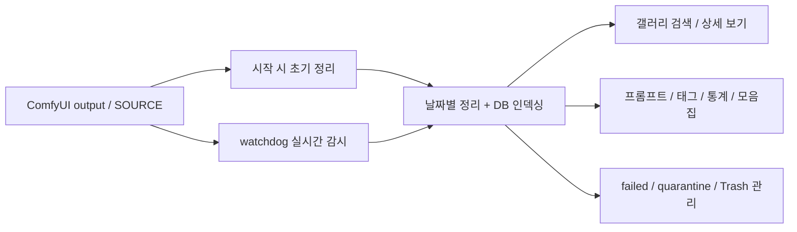

<div align="center">
  
# MyGallery Lite

</div>

<div align="center">

로컬 `ComfyUI output` 폴더를 감시하고, 날짜별로 정리하고, 프롬프트와 태그로 다시 찾게 해주는 개인용 갤러리입니다.


</div>

<div align="center">

[소개](#소개) · [설치 및 실행](#설치-및-실행) · [환경 설정](#env-config) · [기능](#한눈에-보는-기능) · [문제 해결](#문제-해결)

</div>

## 소개

`MyGallery Lite`는 `ComfyUI`에서 쌓이는 이미지와 영상 결과물을 로컬에서 자동 정리하고, 웹 UI로 탐색하고, 태그와 프롬프트 기준으로 다시 찾을 수 있게 만든 `Flask + SQLite` 기반 갤러리입니다.

핵심은 단순합니다.

- `SOURCE` 폴더를 감시합니다.
- 결과물을 `DEST` 아래 날짜 기준으로 정리합니다.
- 메타데이터와 태그를 데이터베이스에 인덱싱합니다.
- 브라우저에서 갤러리, 프롬프트, 태그, 통계, 모음집, 복구 화면으로 관리합니다.

`Lite` 버전은 별도 DB 서버 없이 프로젝트 내부 `SQLite`를 사용하고, 기본 실행도 `127.0.0.1` 로컬 전용으로 동작합니다.

> [!TIP]
> 이 프로젝트는 `SOURCE`만 정확히 잡아도 시작할 수 있습니다. `DEST`는 Lite 정책상 자동 계산됩니다.

> [!WARNING]
> `SOURCE`는 기존 생성물 보관 폴더를 바로 지정하기보다, 새로 만든 별도 수집 폴더로 잡는 것을 권장합니다. 이 앱은 시작 시 `SOURCE` 안의 기존 PNG/영상도 정리 대상으로 보기 때문에, 이미 결과물이 가득한 폴더를 바로 연결하면 파일들이 곧바로 `DEST` 아래로 분류되어 당황할 수 있습니다.

## 설치 및 실행

### 준비 사항

- Windows 권장
- Python `3.10` ~ `3.14`
- `git` 선택 사항
  - 권장: 저장소 `clone` 설치 시 업데이트 기능을 가장 안정적으로 사용할 수 있습니다.
  - 비권장 아님: ZIP 다운로드로도 실행은 가능하지만, 앱 내 업데이트는 `git` 환경이 더 좋습니다.
- 선택 도구
  - `FFmpeg/FFprobe`: 영상 썸네일/메타 처리
  - `ExifTool`: EXIF 읽기/정리
  - `WD14 model`: 자동 태깅

> [!NOTE]
> 기본 서버는 `127.0.0.1`에만 바인딩되며, 실행 후 브라우저가 자동으로 열립니다.

### 빠른 시작

#### 1. 저장소 받기

`git clone` 권장:

```powershell
git clone https://github.com/KickHUB/MyGallery_lite.git
cd MyGallery_lite
```

또는 GitHub ZIP을 내려받아 원하는 폴더에 압축 해제해도 됩니다.

#### 2. `.env` 만들기

```powershell
Copy-Item .env.example .env
```

권장 설정 예시는 아래와 같습니다.

```env
SOURCE={USERPROFILE}/MyGallery_Inbox
DEST_FOLDER_NAME=Sorted_by_Date
PORT=5000
SECRET_KEY=change-me-to-long-random
DEBUG_MODE=0
```

설정 의미:

- `SOURCE`
  - 기존 `ComfyUI/output` 자체보다는 새로 만든 별도 수집 폴더를 권장합니다.
  - 예: `C:/Users/사용자/MyGallery_Inbox`
- `DEST`
  - Lite 정책상 직접 입력하지 않습니다.
  - 내부적으로 항상 `SOURCE/DEST_FOLDER_NAME` 으로 계산됩니다.
- 사용 방식
  - `ComfyUI`의 출력 위치를 이 새 폴더로 바꾸거나
  - 생성물을 이 폴더로 따로 모아서 사용하면 안전합니다.

#### 3. 실행

가장 쉬운 방법은 배치 파일 실행입니다.

```powershell
.\run_mygallery_venv.bat
```

이 스크립트는 다음을 자동으로 처리합니다.

1. `venv`가 없으면 생성
2. `pip`, `setuptools`, `wheel`, `packaging` 업데이트
3. 필수 패키지 설치/보정
4. 첫 실행 시 `portable dependency setup wizard` 조건 확인
5. 런처(`core/app/run_app.py --repair`) 실행
6. 앱 시작 후 브라우저 자동 오픈

#### 4. 첫 실행 설정 마법사

처음 실행하면 콘솔에서 `MyGallery Portable Dependency Setup` 마법사가 나타날 수 있습니다.

이 마법사는 브라우저 UI가 아니라, 런처가 콘솔에서 실행하는 초기 설치 마법사입니다.

주요 질문 항목:

- `FFmpeg` 설치 여부
- `FFprobe` 설치 여부
- `ExifTool` 설치 여부
- `WD14` 모델 설치 여부
- `Danbooru tag DB` 설치 여부

선택한 항목은 `./tools` 아래로 내려받고, 관련 경로는 `.env`에 자동 반영됩니다.

동작 조건:

- 프로젝트를 터미널/배치 파일에서 인터랙티브하게 실행한 경우
- 아직 `tools/portable_setup_state.json` 이 없는 경우

다시 실행하려면:

```powershell
python core/app/run_app.py --portable-tools-setup
```

건너뛰려면:

```powershell
python core/app/run_app.py --skip-portable-tools-setup
```

> [!NOTE]
> 이 마법사는 `SOURCE` 경로를 묻는 설정 마법사는 아닙니다. `SOURCE`는 `.env`에서 직접 지정하거나, 앱 실행 후 설정 화면에서 수정합니다.

#### 5. 접속 확인

정상 실행되면 기본 주소는 아래와 같습니다.

- [http://127.0.0.1:5000](http://127.0.0.1:5000)

브라우저는 보통 자동으로 열리며, 첫 진입 URL은 `/?media=all` 입니다.

### 수동 실행

배치 파일 대신 직접 실행하려면 아래 순서를 따릅니다.

#### Windows PowerShell

```powershell
py -3 -m venv venv
.\venv\Scripts\Activate.ps1
python -m pip install -U pip setuptools wheel
python -m pip install -r requirements.txt
python core/app/run_app.py --repair
```

> [!IMPORTANT]
> `core/app/run_app.py`는 현재 실행 환경이 프로젝트 내부 `venv`인지 확인합니다. 시스템 전역 Python으로 바로 실행하면 종료될 수 있으니 먼저 가상환경을 활성화하세요.

이미 환경이 준비되어 있다면 아래처럼 바로 실행해도 됩니다.

```powershell
python main.py
```

#### 런처 옵션

```powershell
python core/app/run_app.py --repair
python core/app/run_app.py --repair --skip-portable-tools-setup
python core/app/run_app.py --portable-tools-setup
```

설명:

- `--repair`: 누락된 패키지가 있으면 자동 설치
- `--skip-portable-tools-setup`: 휴대형 도구 설치 마법사 건너뛰기
- `--portable-tools-setup`: 휴대형 도구 설치 마법사 강제 실행

## 한눈에 보는 기능

| 영역 | 제공 기능 |
| --- | --- |
| 자동 정리 | `watchdog` 기반 폴더 감시, 시작 시 기존 파일 초기 정리, 날짜별 폴더 정리 |
| 검색/탐색 | 프롬프트/태그 전환 검색, `AND/OR`, 모델/모음집 필터, 랜덤 추천, 페이지네이션 |
| 상세 보기 | EXIF 보기/복사, EXIF 제거 다운로드, Danbooru 태그 편집, Rating 지정, 연관 콘텐츠 탐색 |
| 배치 작업 | 다중 선택, 모음집 일괄 추가/제거, 태그 일괄 추가/삭제, 일괄 다운로드, 비교 |
| 관리 화면 | 프롬프트 목록, Danbooru 태그 통계, 모델/LoRA 통계, 모음집 트리, 휴지통, failed, quarantine |
| 런타임 도구 | `FFmpeg/FFprobe`, `ExifTool`, `WD14` 모델 설치 버튼, Danbooru 태그 DB 업데이트 |
| 설정 | `.env` 안전 편집, 고급 `.env` 전체 편집, 서버 재시작, 검색 기록 삭제 |
| 복구/안전장치 | `failed` 복구, `Trash` 복원, DB 백업 디렉터리 지원, 로컬 IP 제한 |

## 추천 대상

- `ComfyUI output`이 빠르게 쌓여서 결과물을 다시 찾기 어려운 사용자
- 프롬프트, 모델, 태그 기준으로 개인 생성물을 정리하고 싶은 사용자
- 웹 브라우저에서 로컬 전용으로 가볍게 관리하고 싶은 사용자
- 별도 서버나 외부 SaaS 없이 폴더 기반 아카이브를 만들고 싶은 사용자

## 동작 흐름



## 화면 구성

| 화면 | 설명 |
| --- | --- |
| `갤러리` | 이미지/영상 통합 탐색, 프롬프트 또는 태그 검색, 모델/모음집 필터, 랜덤 추천 |
| `프롬프트` | 저장된 프롬프트를 인기순/알파벳순으로 탐색 |
| `태그` | Danbooru 태그를 카테고리별로 확인 |
| `통계` | 모델/LoRA 사용 횟수 집계 |
| `모음집` | 컬렉션 트리 생성, 부모-자식 구조 관리, 필터 연결 |
| `휴지통` | 삭제한 항목 복원 또는 영구 삭제 |
| `실패` | 메타데이터 파싱 실패 항목 확인, 개별/전체 복구 |
| `격리` | 분리 보관된 항목 확인 |
| `설정` | 업데이트, 런타임 설치, `.env` 편집, 서버 재시작 |

<a id="env-config"></a>

## `.env` 상세 설정

### 핵심 설정

| 키 | 필수 | 기본값 | 설명 |
| --- | --- | --- | --- |
| `SOURCE` | 예 | 없음 | 감시할 수집 폴더. 기존 결과물 폴더 자체보다 새로 만든 별도 폴더 권장 |
| `DEST_FOLDER_NAME` | 아니오 | `Sorted_by_Date` | 정리 결과물이 들어갈 하위 폴더명 |
| `PORT` | 아니오 | `5000` | 로컬 웹 서버 포트 |
| `SECRET_KEY` | 권장 | 빈 값 | 세션 안정성을 위해 긴 랜덤 문자열 권장 |
| `DEBUG_MODE` | 아니오 | `0` | 디버그 로그와 Flask 디버그 모드 활성화 |
| `ALLOWED_IPS` | 아니오 | `127.0.0.1,localhost` | 허용 클라이언트 IP 목록 |

### 경로/도구 설정

| 키 | 필수 | 설명 |
| --- | --- | --- |
| `INDEX` | 선택 | 인덱스 저장 경로 |
| `FFMPEG_PATH` | 선택 | `ffmpeg.exe` 경로 |
| `FFPROBE_PATH` | 선택 | `ffprobe.exe` 경로 |
| `FFPLAY_PATH` | 선택 | `ffplay.exe` 경로 |
| `EXIFTOOL_PATH` | 선택 | `exiftool.exe` 경로 |
| `DB_BACKUP_DIR` | 선택 | DB 백업 폴더 경로 |
| `MAX_DB_BACKUPS` | 선택 | 보관할 DB 백업 개수 |

### 태그/자동 태깅 설정

| 키 | 필수 | 설명 |
| --- | --- | --- |
| `BOORU_DICT_SOURCE_PRESET` | 선택 | Danbooru 태그 CSV 소스 프리셋 |
| `BOORU_DICT_CACHE_DIR` | 선택 | 태그 CSV 캐시 폴더 |
| `WD14_MODEL_PATH` | 선택 | WD14 ONNX 모델 경로 |
| `WD14_TAGS_CSV` | 선택 | WD14 태그 CSV 경로 |
| `WD14_AUTO_TAG_ON_REFRESH` | 선택 | 전체 재정리 시 자동 태깅 여부 |

### 경로 작성 팁

- 절대 경로 사용을 권장합니다.
- 상대 경로는 프로젝트 루트 기준으로 해석됩니다.
- 아래 특수 변수 치환을 사용할 수 있습니다.
  - `{USERPROFILE}`
  - `{DESKTOP}`
  - `{DOWNLOADS}`
  - `{PROJECT}`

예시:

```env
SOURCE={USERPROFILE}/MyGallery_Inbox
INDEX={PROJECT}/data/indexes
DB_BACKUP_DIR={PROJECT}/data/db_backups
```

> [!TIP]
> Lite 정책상 `DEST`는 직접 지정하지 않아도 됩니다. 내부적으로 `SOURCE/DEST_FOLDER_NAME`으로 자동 계산됩니다.

> [!IMPORTANT]
> `SOURCE`에 이미 생성물이 많이 들어 있는 폴더를 바로 지정하면, 시작 시 그 파일들이 정리 루틴 대상이 됩니다. 안전하게 시작하려면 비어 있거나 별도로 준비한 새 폴더를 `SOURCE`로 쓰세요.

## 정리 결과 폴더 구조

기본 레이아웃은 아래 흐름을 따릅니다.

```text
SOURCE/
└─ Sorted_by_Date/
   ├─ source/
   │  └─ YYYY-MM-DD/
   │     ├─ images/
   │     ├─ videos/
   │     ├─ audios/
   │     └─ drafts/
   ├─ Drafts/          # 레거시 호환 가능
   ├─ failed/
   ├─ quarantine/
   └─ Trash/
```

프로젝트 내부 데이터는 보통 아래 위치에 쌓입니다.

```text
data/
├─ gallery.db
├─ db_backups/
├─ env_backups/
└─ booru_cache/
```

## 실제 사용 흐름

### 1. SOURCE 연결

- `.env`에서 `SOURCE`를 지정합니다.
- 권장: 기존 결과물 저장소가 아니라 새로 만든 별도 수집 폴더를 사용합니다.
- 앱 실행 후 설정 화면에서 경로를 수정해도 됩니다.

### 2. 첫 실행

- DB 테이블을 초기화합니다.
- 기존 파일을 백그라운드에서 한 번 정리합니다.
- 이후 `watchdog`가 새 파일 유입을 감시합니다.

### 3. 갤러리 탐색

갤러리 화면에서는 다음 작업을 할 수 있습니다.

- 이미지/영상 전환
- 프롬프트 검색과 태그 검색 전환
- `AND / OR` 검색
- 모델, 모음집, `Sampler`, `Seed`, `Steps` 필터
- 랜덤 추천
- 페이지 크기/정렬 변경

### 4. 상세 보기

썸네일 클릭 후 모달에서 다음을 할 수 있습니다.

- 생성 정보 확인
- EXIF 보기 및 복사
- EXIF 제거 다운로드
- Danbooru 태그 수동 추가
- 자동 태깅 실행
- Rating 지정
- 연관 콘텐츠 보기
- 선택 항목 삭제

### 5. 다중 선택

여러 항목을 선택하면 다음 배치 작업이 가능합니다.

- 모음집에 추가/제거
- 일괄 다운로드
- Danbooru 태그 일괄 추가/삭제
- 이미지 비교
- 선택 삭제

## 설정 화면에서 할 수 있는 일

상단 설정 버튼에서 아래 기능을 제공합니다.

- `갤러리 업데이트`
  - 현재 저장소를 기준으로 앱 업데이트
  - `git` 설치 환경에서 가장 안정적
- `Danbooru 태그DB 업데이트`
  - 태그 CSV를 다시 불러와 DB 갱신
- `FFmpeg/FFprobe 설치`
- `ExifTool 설치`
- `WD14 모델 설치`
- `서버 재시작`
- `검색기록 삭제`
- `.env` 안전 편집
- `.env` 고급 직접 편집

> [!WARNING]
> 고급 모드는 `.env` 전체를 직접 수정합니다. 특히 `SECRET_KEY`, 경로, 포트 값을 잘못 저장하면 서버가 부팅되지 않을 수 있습니다.

## 유지보수와 복구 기능

| 기능 | 설명 |
| --- | --- |
| `휴지통` | 삭제 항목 복원 또는 영구 삭제 |
| `failed` | 메타데이터 파싱 실패 항목 추적, 개별/전체 복구 |
| `quarantine` | 분리 보관된 항목 확인 |
| `DB 백업` | 백업 폴더와 보관 개수 설정 가능 |
| `앱 업데이트` | 저장소 기준 업데이트 지원 |

## 문제 해결

### `watchdog`가 시작되지 않을 때

- `SOURCE`가 비어 있지 않은지 확인하세요.
- `SOURCE` 경로가 실제로 존재하는지 확인하세요.
- 시작 로그에 `watchdog start:` 또는 경고 메시지가 출력되는지 확인하세요.

### 브라우저는 열리지만 파일이 안 보일 때

- `SOURCE`가 올바른 폴더인지 확인하세요.
- 첫 실행 직후에는 초기 정리 백그라운드 작업이 끝날 때까지 잠시 기다리세요.
- 필요하면 서버를 재시작한 뒤 다시 확인하세요.

### 영상 썸네일이나 메타데이터가 비정상일 때

- `FFMPEG_PATH`, `FFPROBE_PATH`, `EXIFTOOL_PATH`를 확인하세요.
- 설정 화면의 런타임 설치 버튼으로 다시 설치할 수 있습니다.

### 설정 저장 후 반영이 안 될 때

- 경로, 포트, 런타임 도구, 태그 설정 변경 후에는 서버 재시작이 필요할 수 있습니다.
- 설정 화면에서 `서버 재시작` 버튼을 사용하세요.

### 업데이트 버튼이 동작하지 않을 때

- `git`이 `PATH`에 있는지 확인하세요.
- ZIP 설치 상태라면 `git clone` 설치가 더 안정적입니다.
- 작업 트리가 많이 수정된 상태라면 업데이트가 거부될 수 있습니다.

### `403`이 뜰 때

- `ALLOWED_IPS` 설정을 확인하세요.
- 기본은 로컬 접근만 허용하는 형태로 사용하는 것이 가장 안전합니다.

### Python 버전 오류가 날 때

- 지원 범위는 `3.10 ~ 3.14` 입니다.
- 다른 버전이면 가상환경을 다시 만들고 재실행하세요.

## 프로젝트 구조

```text
.
├─ client/
│  ├─ static/
│  └─ templates/
├─ core/
│  ├─ app/
│  ├─ booru/
│  ├─ db/
│  ├─ media/
│  ├─ ops/
│  ├─ tagging/
│  └─ tasks/
├─ routes/
├─ data/
├─ main.py
├─ settings.py
├─ requirements.txt
└─ run_mygallery_venv.bat
```

## 기술 스택

- Backend: `Flask`
- DB: `SQLite`
- File watch: `watchdog`
- Image: `Pillow`, `ImageHash`
- EXIF/metadata: `pyexiftool`
- HTTP/utility: `requests`, `python-dotenv`, `packaging`
- Auto tagging: `onnxruntime`

## 참고

- 이 프로젝트는 로컬 관리용 워크플로우에 맞춰져 있습니다.
- 기본 UX는 Windows 기준이지만, 수동 실행 자체는 다른 환경에서도 시도할 수 있습니다.
- 다만 기본 배치 파일, 기본 도구 경로, 테스트 흐름은 Windows 중심입니다.
